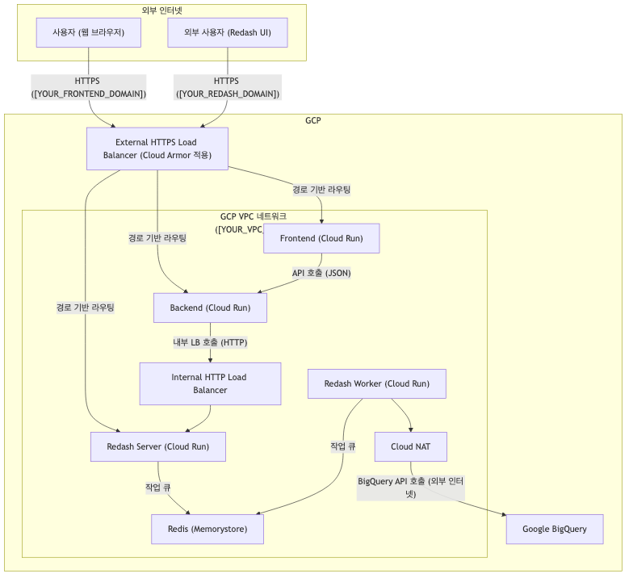

# NL2SQL on GCP: Terraform 배포 및 트러블슈팅 매뉴얼

## 1. 프로젝트 개요

본 문서는 자연어 질의를 SQL로 변환하는 NL2SQL 웹 애플리케-이션을 Google Cloud Platform(GCP)에 Terraform을 사용하여 배포하는 전체 과정과 발생했던 문제들의 해결 과정을 상세히 기록합니다. 이 문서는 프로젝트의 기술적 배경이 없는 사용자도 쉽게 따라 할 수 있도록 구성되었습니다.

- **Frontend URL:** `https://[YOUR_FRONTEND_DOMAIN]`
- **Redash URL:** `https://[YOUR_REDASH_DOMAIN]`
- **GCP 프로젝트:** `[YOUR_GCP_PROJECT_ID]`

## 2. 아키텍처

### 2.1 시스템 구성도



### 2.2 구성 요소 설명

-   **Frontend**: Nginx 기반의 정적 웹 애플리케이션으로, 사용자의 자연어 질문을 받아 백엔드에 전달하고 결과를 시각화합니다.
-   **Backend**: FastAPI(Python) 기반의 API 서버로, 자연어 처리, SQL 생성, Redash 연동 등 핵심 로직을 수행합니다.
-   **Redash Server/Worker**: 데이터 시각화 및 쿼리 실행을 위한 Redash 서버와, 실제 쿼리를 비동기적으로 실행하는 워커입니다.
-   **네트워킹 상세**:
    -   **External HTTPS Load Balancer**: 외부 사용자의 요청을 받는 단일 진입점입니다. `[YOUR_FRONTEND_DOMAIN]`과 `[YOUR_REDASH_DOMAIN]` 두 개의 호스트 규칙(Host rule)을 가지고 있으며, URL 경로에 따라 트래픽을 적절한 백엔드 서비스로 분배합니다.
    -   **Internal HTTP Load Balancer**: VPC 내부에서만 접근 가능한 로드밸런서입니다. `backend` 서비스가 `redash-server`에 안전하고 효율적으로 통신할 수 있도록 고정된 내부 IP를 제공합니다.
    -   **Cloud Armor**: 외부 로드밸런서에 연결된 각 백엔드 서비스(Frontend, Backend, Redash)에 보안 정책을 적용합니다. 현재 정책은 지정된 IP 대역(`[ALLOWED_IP_1]`, `[ALLOWED_IP_2]`)에서의 접근만 허용하고 나머지는 모두 차단합니다.
    -   **VPC & Subnets**: 모든 Cloud Run 서비스와 데이터베이스가 통신하는 격리된 네트워크 환경입니다. 내부 통신을 위한 기본 서브넷 외에, 내부 로드밸런서가 프록시 연결을 위해 사용하는 특수 목적의 **Proxy-only Subnet**이 포함되어 있습니다.
    -   **VPC 방화벽 규칙**:
        -   `allow-health-checks`: 로드밸런서가 Cloud Run 서비스들의 상태를 확인할 수 있도록 특정 IP 대역에서의 `8080` 포트 접근을 허용합니다.
        -   `allow-egress`: VPC 내부의 모든 서비스가 외부 인터넷으로 나갈 수 있도록 허용합니다. 이 규칙은 Cloud NAT와 함께 동작하여 Redash 워커가 BigQuery API를 호출할 수 있게 해줍니다.
    -   **Cloud NAT**: VPC 내부의 서비스가 외부 IP 주소 없이 외부 인터넷에 접근할 수 있도록 경로를 제공합니다.
-   **기타**: Cloud DNS, Cloud SQL, Memorystore, Certificate Manager, Secret Manager 등이 각자의 역할을 수행합니다.

## 3. 배포 절차 (Step-by-Step)

### 3.1 사전 준비

1.  **GCP 프로젝트 및 계정 인증**:
    ```bash
    gcloud auth login
    gcloud config set project [YOUR_GCP_PROJECT_ID]
    gcloud auth application-default login
    ```
2.  **Terraform 설치**:
    ```bash
    brew install terraform
    ```

### 3.2 컨테이너 이미지 빌드 및 푸시

1.  **Artifact Registry 저장소 생성 (최초 한 번만 실행):**
    ```bash
    gcloud artifacts repositories create [REPOSITORY_NAME] --repository-format=docker --location=[GCP_REGION] --description="Repository for NL2SQL project images"
    ```
2.  **Docker 인증 설정:**
    ```bash
    gcloud auth configure-docker [GCP_REGION]-docker.pkg.dev
    ```
3.  **이미지 빌드 및 푸시:**
    ```bash
    # Frontend
    gcloud builds submit ./frontend --tag [GCP_REGION]-docker.pkg.dev/[YOUR_GCP_PROJECT_ID]/[REPOSITORY_NAME]/frontend:latest

    # Backend
    gcloud builds submit ./backend --tag [GCP_REGION]-docker.pkg.dev/[YOUR_GCP_PROJECT_ID]/[REPOSITORY_NAME]/backend:latest

    # Redash Worker
    gcloud builds submit ./redash_worker --tag [GCP_REGION]-docker.pkg.dev/[YOUR_GCP_PROJECT_ID]/[REPOSITORY_NAME]/redash:worker-latest
    ```

### 3.3 Terraform을 이용한 인프라 배포

1.  **Terraform 초기화:**
    ```bash
    cd [TERRAFORM_DIRECTORY]
    terraform init
    ```
2.  **Terraform 배포:** `apply` 명령을 실행합니다. 중간에 Gemini API 키를 입력해야 합니다.
    ```bash
    terraform apply
    ```

### 3.4 Redash 초기 설정

1.  **Redash 접속**: `https://[YOUR_REDASH_DOMAIN]`에 접속하여 관리자 계정을 생성합니다.
2.  **BigQuery 데이터 소스 추가**:
    *   `Settings > Data Sources > New Data Source`를 선택하고 `BigQuery`를 클릭합니다.
    *   GCP 프로젝트 ID (`[YOUR_GCP_PROJECT_ID]`)를 입력하고, **JSON KeyFile**을 업로드합니다.
    *   `Create`를 누르고, `Test Connection`을 통해 연결을 확인합니다.
3.  **API 키 발급**:
    *   우측 상단 프로필 > `Edit Profile` > `API Key` 탭에서 `API Key`를 복사합니다.
    *   이 키를 `[TERRAFORM_DIRECTORY]/cloudrun.tf` 파일의 `REDASH_API_KEY` 환경 변수 값으로 붙여넣고, `terraform apply`를 다시 실행하여 백엔드 서비스를 업데이트합니다.

## 5. 인프라 구성 확인 (GCP Console)

Terraform 배포 후, GCP Console에서 각 리소스가 올바르게 생성되었는지 확인할 수 있습니다.

-   **Cloud Run 서비스**:
    -   `Cloud Run` 메뉴로 이동하여 `[SERVICE_PREFIX]-frontend`, `[SERVICE_PREFIX]-backend`, `[SERVICE_PREFIX]-redash-server`, `[SERVICE_PREFIX]-redash-worker` 서비스가 `[GCP_REGION]` 리전에 생성되었는지 확인합니다.
-   **Load Balancer**:
    -   `네트워크 서비스 > 부하 분산` 메뉴로 이동합니다.
    -   `[LB_PREFIX]-lb-url-map` (외부)과 `[LB_PREFIX]-internal-lb-url-map` (내부) 두 개의 로드밸런서가 생성되었는지 확인합니다.
    -   각 로드밸런서의 전달 규칙, 백엔드 서비스, 상태 확인 설정을 검토할 수 있습니다.
-   **Cloud Armor**:
    -   `네트워크 보안 > Cloud Armor` 메뉴로 이동합니다.
    -   `[POLICY_PREFIX]-default-security-policy-for-redash-server-lb-backend`와 같은 보안 정책들이 생성되었고, 각 정책이 올바른 백엔드 서비스에 연결되었는지 확인합니다.
-   **VPC 네트워크**:
    -   `VPC 네트워크 > 방화벽` 메뉴에서 `[VPC_PREFIX]-allow-health-checks`와 `[VPC_PREFIX]-allow-egress` 규칙이 생성되었는지 확인합니다.
    -   `VPC 네트워크 > VPC 네트워크` 메뉴에서 `[VPC_PREFIX]-vpc`와 그 안의 서브넷들(`[VPC_PREFIX]-sbn`, `[VPC_PREFIX]-proxy-only-sbn` 등)을 확인할 수 있습니다.
-   **Cloud NAT**:
    -   `네트워크 서비스 > Cloud NAT` 메뉴로 이동하여 `[NAT_PREFIX]-nat` 게이트웨이가 `[ROUTER_PREFIX]-router`에 연결되어 활성 상태인지 확인합니다.

## 6. 트러블슈팅 가이드

### Case 1: Redash 접속 불가 (500 Internal Server Error)

-   **증상:** `https://[YOUR_REDASH_DOMAIN]` 접속 시 500 오류.
-   **원인:** Redash 데이터베이스 테이블 미생성.
-   **로그 확인:**
    ```bash
    gcloud logging read "resource.type=\"cloud_run_revision\" AND resource.labels.service_name=\"[SERVICE_PREFIX]-redash-server\""
    ```
    `relation "organizations" does not exist` 오류 확인.
-   **해결:** `redash_db_init.tf`의 비밀번호 및 `entrypoint` 설정 오류를 수정하여 해결.

### Case 2: `/run-sql` API 타임아웃

-   **증상:** API 호출 시 `Redash 쿼리 실행 시간이 초과되었습니다.` 오류.
-   **원인:** Redash 워커가 VPC 내부에 격리되어 외부 BigQuery API로 요청 불가.
-   **로그 확인:**
    ```bash
    gcloud logging read "resource.type=\"cloud_run_revision\" AND resource.labels.service_name=\"[SERVICE_PREFIX]-redash-worker\""
    ```
    쿼리 작업이 완료되지 않고 멈춤.
-   **해결:** `network.tf`에 **Cloud Router**와 **Cloud NAT**를 추가하여 외부 통신 경로를 확보하고 해결.

### Case 3: `/run-sql` API 403 Forbidden

-   **증상:** API 호출 시 `403 Forbidden` 오류.
-   **원인:** 백엔드 서비스의 요청이 Cloud Armor 보안 정책에 의해 차단됨.
-   **로그 확인:**
    ```bash
    gcloud logging read "resource.type=\"http_load_balancer\" AND jsonPayload.enforcedSecurityPolicy.name=\"[POLICY_PREFIX]-default-security-policy-for-redash-server-lb-backend\""
    ```
-   **해결:** `cloud_armor.tf`의 `redash_policy`에 백엔드 서비스의 서브넷 IP 대역(`[SUBNET_IP_RANGE]`)을 허용 규칙으로 추가하여 해결.

### Case 4: 웹사이트 접속 불가 (SSL & DNS)

-   **증상:** `https://[YOUR_FRONTEND_DOMAIN]` 접속 불가.
-   **원인:** Google-managed SSL 인증서 발급 지연 및 DNS 전파 문제.
-   **로그 확인:**
    ```bash
    gcloud certificate-manager certificates describe [CERTIFICATE_NAME] --location=global
    dig [YOUR_FRONTEND_DOMAIN] +short
    ```
-   **해결:** `[YOUR_DOMAIN]`의 상위 DNS Zone에 `[YOUR_FRONTEND_DOMAIN]`의 NS 레코드를 등록하여 DNS 위임 문제를 해결하고, DNS 전파 및 인증서 발급을 기다려 해결.
